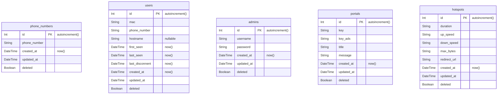

```mermaid
erDiagram
	phone_numbers {
		Int id PK  "autoincrement()"
		String phone_number
		DateTime created_at  "now()"
		DateTime updated_at
		Boolean deleted
	}
	users {
		Int id PK  "autoincrement()"
		String mac
		String phone_number
		String hostname  "nullable"
		DateTime first_seen  "now()"
		DateTime last_seen  "now()"
		DateTime last_disconnent  "now()"
		DateTime created_at  "now()"
		DateTime updated_at
		Boolean deleted
	}
	admins {
		Int id PK  "autoincrement()"
		String username
		String password
		DateTime created_at  "now()"
		DateTime updated_at
		Boolean deleted
	}
	portals {
		Int id PK  "autoincrement()"
		String key
		String key_ads
		String title
		String message
		DateTime created_at  "now()"
		DateTime updated_at
		Boolean deleted
	}
	hotspots {
		Int id PK  "autoincrement()"
		String duration
		String up_speed
		String down_speed
		String max_bytes
		String redirect_url
		DateTime created_at  "now()"
		DateTime updated_at
		Boolean deleted
	}

```
